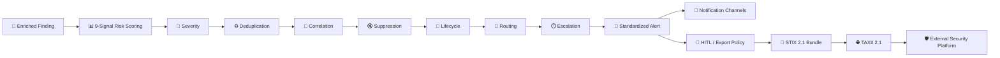
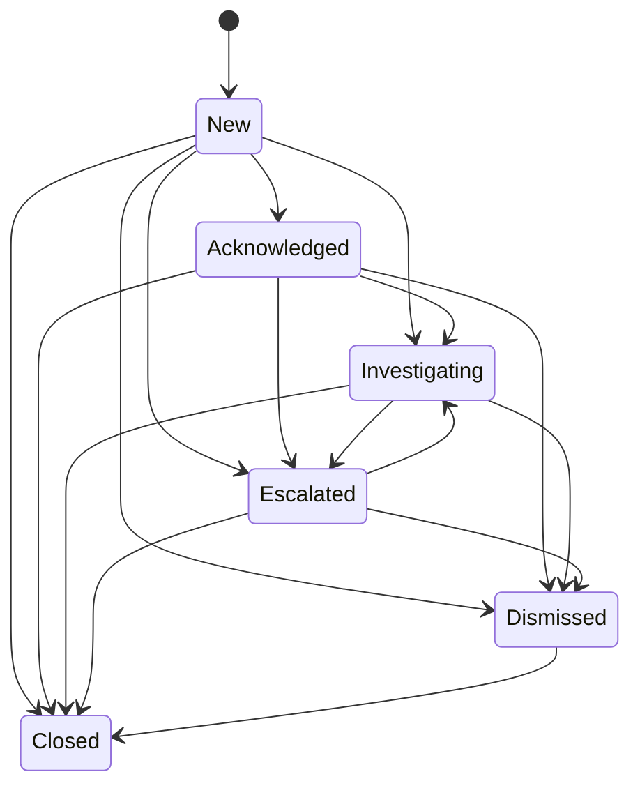

<div align="center">

# 🛡️ Alert Logic & STIX/TAXII Export

### 🚨 From an enriched threat finding to a prioritized, explainable security alert

<p>
  
  
  
  
  
  
</p>

**Decision layer • Risk scoring • Alert lifecycle • Routing • Escalation • STIX/TAXII**

</div>

---

## ✨ What is this?

This module sits between an **enriched threat-intelligence finding** and downstream security systems.

It takes structured intelligence, evaluates its risk, decides the alert severity and routing, manages the alert lifecycle, and — when policy allows — converts the intelligence into **STIX 2.1** and publishes it through **TAXII 2.1**.

> 🎯 **Core idea:** turn raw/enriched threat intelligence into an explainable, standardized, actionable security alert.

---

## 🧭 The Complete Pipeline



### 🔥 Separation of responsibilities

| Layer | What it does |
|---|---|
| 🧠 Finding | Receives enriched threat intelligence |
| 📊 Risk | Calculates a 0–100 risk score |
| 🚦 Severity | Converts score into severity |
| ♻️ Dedup | Prevents repeated alerts |
| 🔗 Correlation | Links related alerts |
| 🔇 Suppression | Applies temporary suppression rules |
| 🔄 Lifecycle | Tracks alert state |
| 📢 Routing | Decides notification channels |
| ⏱️ Escalation | Escalates unacknowledged high-priority alerts |
| 🧩 STIX/TAXII | Standardizes and exports threat intelligence |

> ⚠️ **This module makes routing decisions. It does not directly deliver email, SMS, webhook, SIEM or dashboard notifications.**

---

# 📁 Project Structure

```text
alert_engine/
│
├── ⚙️ config.py
├── 📦 models.py
├── 🗄️ db.py
├── 🔑 fingerprint.py
│
├── 📊 risk.py
├── 🚦 severity.py
├── ♻️ dedup.py
├── 🔗 correlation.py
├── 🔇 suppression.py
├── 🔄 lifecycle.py
├── 👤 hitl.py
├── 📢 routing.py
├── ⏱️ escalation.py
├── 🧠 engine.py
├── ⚙️ celery_app.py
├── 🌐 api.py
│
├── 🧩 stix/
│   ├── mapping.py
│   ├── bundle.py
│   ├── taxii_client.py
│   └── export.py
│
├── 🧪 tests/
├── 🧰 mock_data.py
├── 🎬 demo.py
└── 🗃️ migrations/
```

---

# 🧠 Input → Processing → Output

## 1️⃣ INPUT — Enriched Finding

The module expects an **enriched finding** from the upstream NLP/enrichment/matching pipeline.

### Minimum useful structure

```json
{
  "finding_id": "TEST-HIGH-001",
  "source_id": "darktrace",
  "title": "Suspicious credential activity",
  "description": "Credential-related activity detected",
  "language": "en",
  "threat_type": "unauthorized_access",
  "classification": "credential_compromise",
  "entities": [
    {
      "type": "account",
      "value": "admin-test"
    }
  ],
  "indicators": [
    {
      "type": "email",
      "value": "admin@test.example"
    }
  ],
  "watchlist_hits": [
    "admin-test"
  ],
  "threat_score": 0.80,
  "confidence": 0.90,
  "feature_vector": {}
}
```

### 🧩 Optional explicit risk signals

```json
{
  "signals": {
    "keyword": 0.75,
    "classification": 0.75,
    "entities": 0.75,
    "history": 0.60,
    "behavior": 0.70,
    "temporal": 0.60,
    "feedback": 0.60
  }
}
```

If an upstream signal is not supplied, the engine uses a **neutral value of `0.5`**.

---

# 📊 9-Signal Risk Engine

The risk engine combines nine signal families.

| Signal | Weight |
|---|---:|
| 🔎 Keyword | 22% |
| 🧠 Classification | 24% |
| 👤 Entities | 10% |
| 🕘 History | 10% |
| ⭐ Source reputation | 10% |
| 🧬 Behavior | 8% |
| ⏰ Temporal | 4% |
| 👨‍💻 Analyst feedback | 8% |
| 🎯 Confidence | 4% |
| **TOTAL** | **100%** |

The result is normalized to:

```text
0 ──────────────────────────────── 100
Low Risk                         High Risk
```

The engine also produces a **risk breakdown**, making the score explainable instead of returning only a number.

---

# 🚦 Severity Model

```text
0 ───── 24     🟦 INFORMATIONAL
25 ──── 44     🟢 LOW
45 ──── 64     🟡 MEDIUM
65 ──── 84     🟠 HIGH
85 ─── 100     🔴 CRITICAL
```

| Score | Severity | Meaning |
|---:|---|---|
| 0–24 | 🟦 Informational | Low-priority information |
| 25–44 | 🟢 Low | Low-risk finding |
| 45–64 | 🟡 Medium | Requires attention |
| 65–84 | 🟠 High | High-priority alert |
| 85–100 | 🔴 Critical | Critical-priority alert |

> Thresholds are configurable and can be tenant-specific.

---

# 📢 Alert Routing

Severity determines the default notification routing.

| Severity | Channels |
|---|---|
| 🟦 Informational | `batch_digest` |
| 🟢 Low | `batch_digest` + `dashboard` |
| 🟡 Medium | `dashboard` + `email` |
| 🟠 High | `dashboard` + `email` + `webhook` |
| 🔴 Critical | `dashboard` + `email` + `webhook` + `sms_push` + `siem` + `on_call` |

### Important

```text
STIX/TAXII ≠ notification routing
```

STIX/TAXII is controlled independently by the export/HITL policy.

---

# ♻️ Deduplication

The engine creates a stable alert fingerprint.

Default:

```text
24 hours
```

Configuration:

```env
ALERT_DEDUP_WINDOW_HOURS=24
```

Conceptually:

```text
Finding A ──┐
Finding B ──┼──► Same Fingerprint ──► Existing Alert
Finding C ──┘
```

This prevents the same underlying event from generating unnecessary duplicate alerts.

---

# 🔗 Correlation

Alerts can be related through:

- 👤 Shared threat actor
- 🔑 Shared indicators / IOCs

Example:

```text
Finding A ──► Actor X ──► Alert A
Finding B ──► Actor X ──► Alert B
                         │
                         ▼
                  Related Alerts
```

Correlation is separate from deduplication.

---

# 🔇 Suppression

Suppression rules can contain:

```text
Scope
Reason
Expiration
```

Example:

```text
Rule:
    Scope      → test-environment
    Reason     → authorized security testing
    Expires    → configured expiration
```

Expired suppression rules should no longer suppress alerts.

---

# 🔄 Alert Lifecycle



### State aliases

```text
dismissed → False Positive
closed    → Resolved
```

The implementation keeps six explicit lifecycle states:

```text
new
acknowledged
investigating
escalated
dismissed
closed
```

---

# ⏱️ Escalation

### 🔴 Critical

```text
First escalation  → 15 minutes
Repeat escalation → 30 minutes
Maximum           → 5
```

### 🟠 High

```text
First escalation  → 60 minutes
Repeat escalation → 120 minutes
Maximum           → 3
```

Conceptually:

```text
New Alert
   │
   ├── Acknowledged ──► Stop escalation
   │
   └── Not acknowledged
             │
             ▼
        ⏱️ Escalate
             │
             ▼
        ⏱️ Repeat
             │
             ▼
        Maximum reached
```

---

# 🚨 Standardized Alert Output

The central output is a standardized **Alert** object.

### Output structure

```text
🚨 Alert
│
├── 🆔 alert_id
├── 🔑 fingerprint
├── 🔗 finding_id
├── 📡 source_id
├── 👁️ watchlist_id
├── 🚦 severity
├── 📊 risk_score
├── 🎯 confidence
├── 🔄 state
├── 🕐 first_seen
├── 🕐 last_seen
├── 🔢 count
├── 📢 channels
├── 🧠 risk_breakdown
├── 🔗 related_alert_ids
└── 🧩 stix_export_status
```

### Example

```json
{
  "alert_id": "ALT-001",
  "fingerprint": "abc123...",
  "finding_id": "TEST-HIGH-001",
  "source_id": "darktrace",
  "severity": "high",
  "risk_score": 74,
  "confidence": 0.80,
  "state": "new",
  "count": 1,
  "channels": [
    "dashboard",
    "email",
    "webhook"
  ],
  "risk_breakdown": {
    "keyword": 0.75,
    "classification": 0.75,
    "entities": 0.75,
    "history": 0.60,
    "behavior": 0.70,
    "temporal": 0.60,
    "feedback": 0.60
  },
  "related_alert_ids": [],
  "stix_export_status": "pending_approval"
}
```

---

# 🧩 STIX 2.1 + TAXII 2.1

When export is permitted:

```text
🚨 Alert
   │
   ▼
🧩 STIX 2.1 Mapping
   │
   ├── Indicator
   ├── Observed Data
   ├── Threat Actor
   └── Relationship
   │
   ▼
📦 STIX Bundle
   │
   ▼
🌐 TAXII 2.1
   │
   ▼
🛡️ External Security Platform
```

### Export policy

| Severity | STIX/TAXII policy |
|---|---|
| 🟦 Informational | ❌ Excluded |
| 🟢 Low | ❌ Excluded |
| 🟡 Medium | 👤 HITL approval |
| 🟠 High | 👤 HITL approval |
| 🔴 Critical | ⚡ Auto-approved |

> A real TAXII server is required only for external publication.

---

# 👤 HITL Approval

Medium and High alerts require human approval before external STIX/TAXII publication.

### Approve

```http
POST /v1/alerts/{alert_id}/stix-export/approve
X-Actor-ID: analyst-001
```

### Reject

```http
POST /v1/alerts/{alert_id}/stix-export/reject
X-Actor-ID: analyst-001
```

Approval immediately attempts export.

Rejection records the decision without publishing the bundle.

---

# 🌐 API

| Method | Endpoint | Purpose |
|---|---|---|
| `POST` | `/v1/findings` | Ingest enriched finding |
| `GET` | `/v1/alerts/{alert_id}` | Retrieve alert |
| `POST` | `/v1/alerts/{alert_id}/stix-export/approve` | Approve STIX export |
| `POST` | `/v1/alerts/{alert_id}/stix-export/reject` | Reject STIX export |
| `GET` | `/healthz` | Health check |

Interactive API documentation:

```text
/docs
/openapi.json
```

---

# ⚙️ Configuration

```env
ALERT_ENGINE_DB_URL=sqlite:///./alert_engine.db
ALERT_ENGINE_INGEST_API_KEY=change-this-key

CELERY_BROKER_URL=redis://localhost:6379/0
CELERY_RESULT_BACKEND=redis://localhost:6379/1

TAXII_DISCOVERY_URL=
TAXII_API_ROOT=
TAXII_COLLECTION_ID=
TAXII_USERNAME=
TAXII_PASSWORD=

TAXII_VERIFY_TLS=true
TAXII_TIMEOUT_SECONDS=15
TAXII_MAX_RETRIES=3

ALERT_DEDUP_WINDOW_HOURS=24
```

### 🔐 Where do TAXII values come from?

These values come from the **TAXII server / threat-intelligence platform** you connect to.

```text
TAXII_API_ROOT
        ↓
Your TAXII server API root

TAXII_COLLECTION_ID
        ↓
The collection where STIX objects are published

TAXII_USERNAME / PASSWORD
        ↓
Credentials issued by that TAXII server
```

If no TAXII server is available, keep these values empty and test the complete alert pipeline without external publication.

---

# 🛠️ Technology Stack

| Area | Technology |
|---|---|
| 🐍 Language | Python |
| 🌐 API | FastAPI |
| ✅ Validation | Pydantic |
| 🗄️ Database | SQLite / SQLAlchemy |
| ⚙️ Background jobs | Celery |
| 📨 Broker | Redis |
| 🧩 Threat intelligence | STIX 2.1 |
| 🌐 Transport | TAXII 2.1 |
| 🔗 HTTP | Requests |
| 🧪 Testing | Pytest |
| 🗃️ Migrations | Alembic |

---

# 🚀 Installation

## Windows

```powershell
python -m venv .venv
.venv\Scripts\activate
pip install -r requirements.txt
```

## Linux / macOS

```bash
python -m venv .venv
source .venv/bin/activate
pip install -r requirements.txt
```

---

# ▶️ Run the API

```bash
uvicorn alert_engine.api:app --reload --port 8001
```

Then open:

```text
http://localhost:8001/docs
```

> `8001` is used in the current development setup.

---

# 🧪 Testing

Run:

```bash
pytest
```

The test suite covers:

```text
✅ Nine-signal risk scoring
✅ Risk breakdown
✅ Severity boundaries
✅ Tenant severity overrides
✅ Fingerprint stability
✅ Deduplication
✅ Correlation
✅ Suppression
✅ Lifecycle transitions
✅ Routing
✅ HITL approval
✅ HITL rejection
✅ Escalation
✅ STIX mapping
✅ STIX patterns
✅ STIX bundle validity
✅ TAXII publish success/failure
✅ TAXII retry behavior
✅ Export auditing
✅ Critical auto-approval
✅ High-severity HITL flow
```

---

# 🧪 Example Test Scenarios

## 🟠 High-signal test

```json
{
  "finding_id": "TEST-HIGH-SIGNALS-001",
  "threat_type": "unauthorized_access",
  "confidence": 0.80,
  "source_id": "darktrace",
  "indicators": [
    {
      "type": "ip",
      "value": "203.0.113.42"
    },
    {
      "type": "credential",
      "value": "svc-admin@example.com"
    }
  ],
  "signals": {
    "keyword": 0.75,
    "classification": 0.75,
    "entities": 0.75,
    "history": 0.60,
    "behavior": 0.70,
    "temporal": 0.60,
    "feedback": 0.60
  }
}
```

Expected processing:

```text
Risk
 ↓
High severity
 ↓
dashboard + email + webhook
 ↓
HITL required for STIX/TAXII
```

---

## 🔴 Critical test

```json
{
  "finding_id": "TEST-CRITICAL-SIGNALS-001",
  "threat_type": "ransomware",
  "confidence": 0.95,
  "source_id": "darktrace",
  "indicators": [
    {
      "type": "email",
      "value": "admin@example.com"
    },
    {
      "type": "ip",
      "value": "198.51.100.23"
    },
    {
      "type": "file_hash",
      "value": "e3b0c44298fc1c149afbf4c8996fb92427ae41e4649b934ca495991b7852b855"
    }
  ],
  "signals": {
    "keyword": 0.95,
    "classification": 0.97,
    "entities": 0.90,
    "history": 0.70,
    "behavior": 0.85,
    "temporal": 0.60,
    "feedback": 0.55
  }
}
```

Expected policy flow:

```text
🔴 Critical
     ↓
⚡ Auto-approved
     ↓
🧩 STIX 2.1 Bundle
     ↓
🌐 TAXII 2.1
```

A configured and reachable TAXII server is required for successful external publication.

---

# 📴 Testing Without TAXII

You can test almost the entire alert engine without a TAXII server.

```text
Input
 ↓
Risk
 ↓
Severity
 ↓
Dedup
 ↓
Correlation
 ↓
Suppression
 ↓
Lifecycle
 ↓
Routing
 ↓
Escalation
 ↓
🚨 Alert
```

Only this final path requires a real TAXII service:

```text
Alert
 ↓
STIX Bundle
 ↓
TAXII Publication
```

---

# 🎬 Demo

Run:

```bash
python demo.py
```

The demo generates a mock ransomware finding and demonstrates the alert-processing pipeline.

---

# 🔐 Security

### HTTPS

TAXII communication requires HTTPS.

```env
TAXII_VERIFY_TLS=true
```

### Secrets

Never commit these to source control:

```text
TAXII_PASSWORD
TAXII_USERNAME
ALERT_ENGINE_INGEST_API_KEY
```

### API Authentication

If:

```env
ALERT_ENGINE_INGEST_API_KEY=your-secret-key
```

is configured, requests must include:

```http
X-API-Key: your-secret-key
```

### Auditability

Export approval/rejection decisions are recorded with an actor identifier.

---

# 🎯 Current Scope

```text
🧠 Alert Decisioning
📊 Risk Scoring
🚦 Severity Classification
♻️ Deduplication
🔗 Correlation
🔇 Suppression
🔄 Lifecycle
📢 Routing
⏱️ Escalation
🧩 STIX 2.1
🌐 TAXII 2.1
👤 HITL Approval
📋 Export Status
🧾 Export Auditing
```

---

# 🚫 Out of Scope

This module does **not** perform:

```text
❌ Direct email/SMS/webhook delivery
❌ Endpoint remediation
❌ Automated takedown
❌ Threat-actor de-anonymization
❌ Unauthorized access to systems
❌ CAPTCHA/access-control bypass
❌ Autonomous attribution
❌ Autonomous intent prediction
❌ Illegal purchases
❌ Public release of raw evidence
```

---

# 🧱 Design Principles

| Principle | Implementation |
|---|---|
| 🔍 Explainability | Per-signal risk breakdown |
| 👤 Human oversight | HITL for Medium/High export |
| 🔐 Security | API key + HTTPS TAXII |
| ♻️ Noise reduction | Deduplication + suppression |
| 🔗 Context | Alert correlation |
| 📋 Standardization | STIX 2.1 |
| 🌐 Interoperability | TAXII 2.1 |
| 🧾 Auditability | Export decision/status tracking |
| ⚙️ Configurability | Environment + tenant policies |

---

# 🏁 End-to-End Summary

```text
                    ┌─────────────────────┐
                    │  🧠 ENRICHED FINDING │
                    └──────────┬──────────┘
                               ↓
                    ┌─────────────────────┐
                    │ 📊 RISK ENGINE      │
                    │    9 Signals        │
                    └──────────┬──────────┘
                               ↓
                    ┌─────────────────────┐
                    │ 🚦 SEVERITY         │
                    │ Info → Critical     │
                    └──────────┬──────────┘
                               ↓
             ┌─────────────────────────────────┐
             │ ♻️ Dedup → 🔗 Correlation      │
             │ 🔇 Suppression → 🔄 Lifecycle  │
             └────────────────┬────────────────┘
                              ↓
                    ┌─────────────────────┐
                    │ 🚨 STANDARD ALERT   │
                    └──────────┬──────────┘
                               ↓
                    ┌─────────────────────┐
                    │ 📢 ROUTING +        │
                    │ ⏱️ ESCALATION       │
                    └──────────┬──────────┘
                               ↓
                    ┌─────────────────────┐
                    │ 👤 HITL / POLICY    │
                    └──────────┬──────────┘
                               ↓
                    ┌─────────────────────┐
                    │ 🧩 STIX 2.1         │
                    └──────────┬──────────┘
                               ↓
                    ┌─────────────────────┐
                    │ 🌐 TAXII 2.1        │
                    └──────────┬──────────┘
                               ↓
                    ┌─────────────────────┐
                    │ 🛡️ SECURITY PLATFORM│
                    └─────────────────────┘
```

<div align="center">

### 🛡️ Alert Logic & STIX/TAXII
**Turning enriched threat intelligence into explainable, actionable, interoperable security alerts.**

</div>
